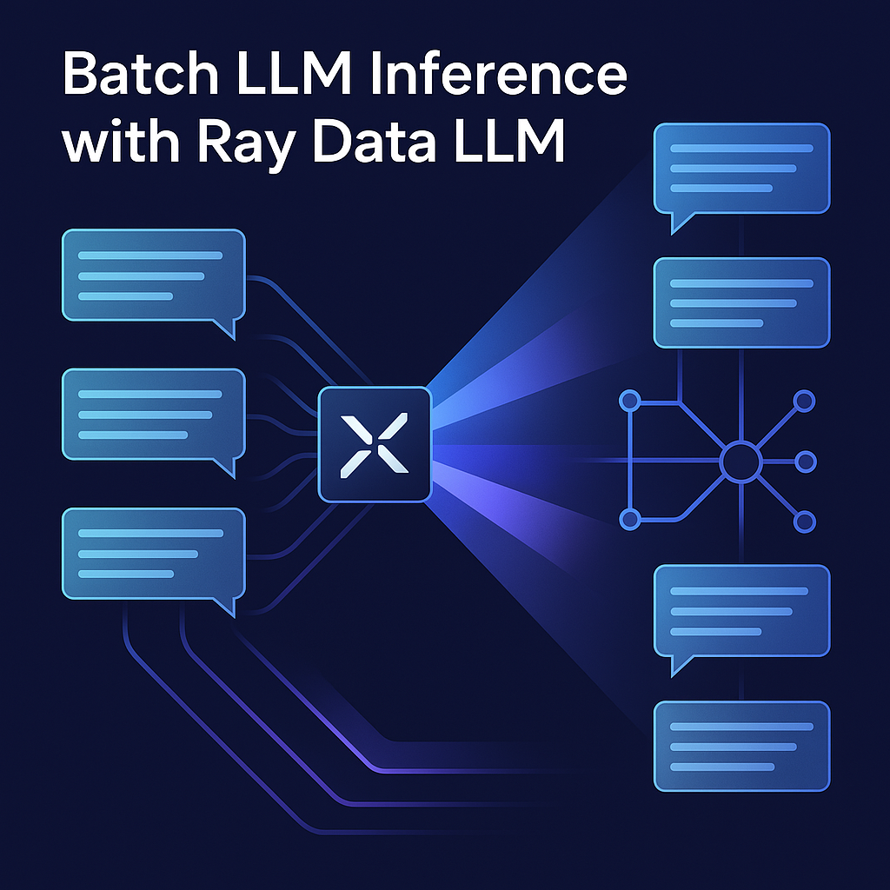

<div align="center">
    
</div>

# Batch LLM Inference with Ray Data LLM

## Table of Contents

<details>
  <summary><a href="#1-introduction"><i><b>1. Introduction</b></i></a></summary>
  <div>
              <a href="#11-ray">1.1. Ray</a><br>
              <a href="#12-ray-data-llm">1.2. Ray Data LLM</a><br>
              <a href="#13-problem-generate-responses-to-common-questions">1.3. Problem: Generate Responses to Common Questions</a><br>
              <a href="#14-what-you-want">1.4. What You Want</a><br>
              <a href="#15-how-ray-data-llm-helps">1.5. How Ray Data LLM Helps</a><br>
              <a href="#16-why-use-ray-data-llm">1.6. Why Use Ray Data LLM</a><br>
              <a href="#17-next-steps">1.7. Next Steps</a><br>
  </div>
</details>

<details>
  <summary><a href="#2-fundamental-level-generating-responses-to-common-questions"><i><b>2. Fundamental Level: Generating Responses to Common Questions</b></i></a></summary>
  <div>
              <a href="#21-problem">2.1. Problem</a><br>
              <a href="#22-example-questions">2.2. Example Questions</a><br>
              <a href="#23-why-batch-processing">2.3. Why Batch Processing</a><br>
              <a href="#24-real-life-example">2.4. Real-Life Example</a><br>
  </div>
</details>

<details>
  <summary><a href="#3-intermediate-level-text-generation-from-user-prompts"><i><b>3. Intermediate Level: Text Generation from User Prompts</b></i></a></summary>
  <div>
              <a href="#31-problem">3.1. Problem</a><br>
              <a href="#32-example-prompts">3.2. Example Prompts</a><br>
              <a href="#33-why-use-ray-data-llm">3.3. Why Use Ray Data LLM</a><br>
  </div>
</details>

<details>
  <summary><a href="#4-advanced-level-real-world-use-case"><i><b>4. Advanced Level: Real-World Use Case</b></i></a></summary>
  <div>
              <a href="#41-problem">4.1. Problem</a><br>
              <a href="#42-why-batch-processing">4.2. Why Batch Processing</a><br>
              <a href="#43-how-ray-data-llm-helps">4.3. How Ray Data LLM Helps</a><br>
  </div>
</details>

<details>
  <summary><a href="#5-announcing-native-llm-apis-in-ray-data-and-ray-serve"><i><b>5. Announcing Native LLM APIs in Ray Data and Ray Serve</b></i></a></summary>
  <div>
              <a href="#51-introduction">5.1. Introduction</a><br>
              <a href="#52-ray-data-llm">5.2. Ray Data LLM</a><br>
              <a href="#53-ray-serve-llm">5.3. Ray Serve LLM</a><br>
              <a href="#54-future-developments">5.4. Future Developments</a><br>
              <a href="#55-additional-resources">5.5. Additional Resources</a><br>
  </div>
</details>

<details>
  <summary><a href="docs/jargon.md"><i><b>6. Technical Jargon Glossary</b></i></a></summary>
  <div>
              A comprehensive glossary of technical terms and concepts used in this project.
  </div>
</details>

## 1. Introduction

Think about a customer support bot that receives 1000 similar questions every day. Instead of answering each one as it comes, you could collect the questions and process them in bulk (Batch processing), giving quick responses to all of them at once.

Batch processing is essential when generating text responses efficiently using large language models (LLMs). Instead of processing each input one by one, batch inference allows the handling of multiple inputs at once, making it faster and more scalable.

In this tutorial, we will start with a straightforward problem to introduce the concept of batch inference with Ray Data LLM. We will then progress to more advanced scenarios, gradually building your understanding and skills.

### 1.1. Ray

Ray is an open-source framework for building and running distributed applications. It enables developers to scale Python applications from a single machine to a cluster, making parallel computing more accessible. Ray provides a unified API for various tasks such as data processing, model training, and inference.

Key Features:

* Distributed computing made easy with Pythonic syntax
* Built-in support for machine learning workflows
* Libraries for hyperparameter tuning (Ray Tune), model serving (Ray Serve), and data processing (Ray Data)
* Scales seamlessly from a single machine to a large cluster

### 1.2. Ray Data LLM

Ray Data LLM is a module within Ray designed for batch inference using large language models (LLMs). It allows developers to perform batch text generation efficiently by integrating LLM processing into existing Ray Data pipelines.

Key Features:

* Batch Processing:
  * Simultaneous processing of multiple inputs for faster throughput
* Efficient Scaling:
  * Distributes tasks across multiple CPUs/GPUs
* Seamless Integration:
  * Works with popular LLMs like Meta Llama
* OpenAI Compatibility:
  * Easily integrates with OpenAI API endpoints

By using Ray Data LLM, developers can scale their LLM-based applications without the hassle of manual optimization or distributed computing setups.

### 1.3. Problem: Generate Responses to Common Questions

Imagine you have a list of common questions people might ask a chatbot. Instead of responding to each question one by one, you want to generate answers for all the questions at once.

#### 1.3.1. Example Questions:

1. "What is the weather like today?"
2. "Tell me a joke."
3. "Give me a motivational quote."
4. "What is 2+2?"

### 1.4. What You Want:

Instead of sending each question to the chatbot separately, you want to batch process them all at once, saving time and computing resources.

### 1.5. How Ray Data LLM Helps:

* **Batch Processing:** Instead of generating responses one by one, Ray Data LLM lets you process all questions simultaneously.
* **Efficient Scaling:** If you have 1000 questions, the system can distribute the workload across multiple processors, making it much faster.

### 1.6. Why Use Ray Data LLM?

Ray Data LLM integrates seamlessly with existing Ray Data pipelines, allowing for efficient batch inference with LLMs. It enables:

* High-throughput processing
* Distributed execution
* Integration with OpenAI-compatible endpoints
* Support for popular LLMs like Meta Llama

### 1.7. Next Steps

Ray Data LLM provides a simple and scalable way to perform batch inference using LLMs. Starting from basic chatbot responses to complex sentiment analysis, it enables high-throughput text generation and processing.

* Set up Ray and Ray Data on your system.
* Follow the provided code examples to implement the discussed problems.
* Experiment with different models and configurations for better performance.

## 2. Fundamental Level: Generating Responses to Common Questions

### 2.1. Problem

Imagine you have a list of common questions that people might ask a chatbot. Instead of generating a response for each question one by one, you want to generate answers for all the questions at once.

#### 2.2. Example Questions:

1. "What is the weather like today?"
2. "Tell me a joke."
3. "Give me a motivational quote."
4. "What is 2+2?"

### 2.3. Why Batch Processing?

Instead of sending each question to the chatbot separately, batch processing allows you to process all questions simultaneously, saving time and computing resources.

#### 2.4. Real-Life Example

Think about a customer support bot that receives thousands of similar questions daily. Instead of answering each one as it arrives, you could collect them and process them all at once, providing quick responses efficiently.

## 3. Intermediate Level: Text Generation from User Prompts

### 3.1. Problem

Now, imagine you have a list of user prompts for creative text generation. Instead of generating each text separately, you want to create a pipeline that processes all prompts together.

#### 3.2. Example Prompts:

* "Write a haiku about nature."
* "Generate a short story about space exploration."
* "Summarize the following paragraph..."

### 3.3. Why Use Ray Data LLM?

* You can use Ray Data to load a large number of prompts at once.
* Ray Data LLM allows you to batch process these prompts with the selected LLM model.

## 4. Advanced Level: Real-World Use Case

### 4.1. Problem

You have a dataset containing thousands of social media posts. You want to classify the sentiment (positive, negative, neutral) of each post using an LLM.

### 4.2. Why Batch Processing?

Performing sentiment analysis on each post individually would take too much time. By batching, you can classify the entire dataset at once.

#### 4.3. How Ray Data LLM Helps:

* Efficiently loads the dataset.
* Applies the LLM processor to generate sentiment labels.
* Uses distributed processing to handle large volumes of data efficiently.

## 5. Announcing Native LLM APIs in Ray Data and Ray Serve

By The Anyscale Team | April 2, 2025

### 5.1 Introduction

Today, we're excited to announce native APIs for LLM inference with Ray Data and Ray Serve.

As LLMs become increasingly central to modern AI infrastructure deployments, platforms require the ability to deploy and scale these models efficiently. While Ray Data and Ray Serve are suitable for this purpose, developers have to write a sizable amount of boilerplate in order to leverage the libraries for scaling LLM applications.

In Ray 2.44, we're announcing **Ray Data LLM** and **Ray Serve LLM**.

- **Ray Data LLM** provides APIs for offline batch inference with LLMs within existing Ray Data pipelines
- **Ray Serve LLM** provides APIs for deploying LLMs for online inference in Ray Serve applications.

Both modules offer first-class integration for vLLM and OpenAI compatible endpoints.

### 5.2 Ray Data LLM

The `ray.data.llm` module integrates with key large language model (LLM) inference engines and deployed models to enable LLM batch inference.

Ray Data LLM is designed to address several common developer pains around batch inference:

- We saw that many users were building ad-hoc solutions for high-throughput batch inference. These solutions would entail launching many online inference servers and build extra proxying/load balancing utilities to maximize throughput. To address this, we wanted to leverage Ray Data and take advantage of pre-built distributed data loading and processing functionality.
- We saw common patterns of users sending batch data to an existing inference server. To address this, we wanted to make sure that users could integrate their data pipelines with an OpenAI compatible API endpoint, and provide the flexibility for the user to be able to templatize the query sent to the server.
- We saw that users were integrating LLMs into existing Ray Data pipelines (chaining LLM post-processing stages). To address this, we wanted to make sure that the API was compatible with the existing lazy and functional Ray Data API.


With Ray Data LLM, users create a Processor object, which can be called on a Ray Data Dataset and will return a Ray Data dataset. The processor object will contain configuration like:

- Prompt and template
- OpenAI compatible sampling parameters, which can be specified per row
- vLLM engine configuration, if applicable

```python
import ray
from ray.data.llm import vLLMEngineProcessorConfig, build_llm_processor
import numpy as np

config = vLLMEngineProcessorConfig(
    model="meta-llama/Llama-3.1-8B-Instruct",
    engine_kwargs={
        "enable_chunked_prefill": True,
        "max_num_batched_tokens": 4096,
        "max_model_len": 16384,
    },
    concurrency=1,
    batch_size=64,
)
processor = build_llm_processor(
    config,
    preprocess=lambda row: dict(
        messages=[
            {"role": "system", "content": "You are a bot that responds with haikus."},
            {"role": "user", "content": row["item"]}
        ],
        sampling_params=dict(
            temperature=0.3,
            max_tokens=250,
        )
    ),
    postprocess=lambda row: dict(
        answer=row["generated_text"],
        **row  # This will return all the original columns in the dataset.
    ),
)

ds = ray.data.from_items(["Start of the haiku is: Complete this for me..."])

ds = processor(ds)
ds.show(limit=1)
```

In this particular example, the Processor object will:

- Perform the necessary preprocessing and postprocessing to handle LLM outputs properly
- Instantiate and configure multiple vLLM replicas, depending on specified concurrency and provided engine configurations. Each of these replicas can themselves be distributed as well.
- Continuously feed each replica by leveraging async actors in Ray to take advantage of continuous batching and maximize throughput
- Invoke various Ray Data methods (`map`, `map_batches`) which can be fused and optimized with other preprocessing stages in the pipeline by Ray Data during execution.

As you can see, Ray Data LLM can easily simplify the usage of LLMs within your existing data pipelines. See the documentation for more details.

### 5.3 Ray Serve LLM

Ray Serve LLM APIs allow users to deploy multiple LLM models together with a familiar Ray Serve API, while providing compatibility with the OpenAI API.

Ray Serve LLM is designed with the following features:

- Automatic scaling and load balancing
- Unified multi-node multi-model deployment
- OpenAI compatibility
- Multi-LoRA support with shared base models
- Deep integration with inference engines (vLLM to start)
- Composable multi-model LLM pipelines

While vLLM has grown rapidly over the last year, we have seen a significant uptick of users leveraging Ray Serve to deploy vLLM for multiple models and program more complex pipelines.

For production deployments, Ray Serve + vLLM are great complements.


vLLM provides a simple abstraction layer to serve hundreds of different models with high throughput and low latency. However, vLLM is only responsible for single model replicas, and for production deployments you often need an orchestration layer to be able to autoscale, handle different fine-tuned adapters, handle distributed model-parallelism, and author multi-model, compound AI pipelines that can be quite complex.

Ray Serve is built to address the gaps that vLLM has for scaling and productionization. Ray Serve offers:

- Pythonic API for autoscaling
- Built-in support for model multiplexing
- Provides a Pythonic, imperative way to write complex multi-model / deployment pipelines
- Has first-class support for distributed model parallelism by leveraging Ray.

Below is a simple example of deploying a Qwen model with Ray Serve on a local machine with two GPUs behind an OpenAI-compatible router, then querying it with the OpenAI client.

```python
from ray import serve
from ray.serve.llm import LLMConfig, LLMServer, LLMRouter

llm_config = LLMConfig(
    model_loading_config=dict(
        model_id="qwen-0.5b",
        model_source="Qwen/Qwen2.5-0.5B-Instruct",
    ),
    deployment_config=dict(
        autoscaling_config=dict(
            min_replicas=1, max_replicas=2,
        )
    ),
    # Pass the desired accelerator type (e.g. A10G, L4, etc.)
    accelerator_type="A10G",
    # You can customize the engine arguments (e.g. vLLM engine kwargs)
    engine_kwargs=dict(
        tensor_parallel_size=2,
    ),
)

# Deploy the application
deployment = LLMServer.as_deployment(
    llm_config.get_serve_options(name_prefix="vLLM:")).bind(llm_config)
llm_app = LLMRouter.as_deployment().bind([deployment])
serve.run(llm_app)
```

And then you can query this with the OpenAI Python API:

```python
from openai import OpenAI

# Initialize client
client = OpenAI(base_url="http://localhost:8000/v1", api_key="fake-key")

# Basic chat completion with streaming
response = client.chat.completions.create(
    model="qwen-0.5b",
    messages=[{"role": "user", "content": "Hello!"}],
    stream=True
)

for chunk in response:
    if chunk.choices[0].delta.content is not None:
        print(chunk.choices[0].delta.content, end="", flush=True)
```

Ray Serve LLM can also be deployed on Kubernetes by using KubeRay. Take a look at the Ray Serve production guide for more details.

### 5.4 Future Developments

Give these new features a spin and let us know your feedback! If you're interested in chatting with developers, feel free to join the Ray Slack or participate on Discourse, and follow the roadmap for Ray Serve LLM and Ray Data LLM for future updates.

### 5.5 Additional Resources

- [Ray Data LLM Documentation](https://docs.ray.io/en/latest/ray-data/llm.html)
- [Ray Serve LLM Documentation](https://docs.ray.io/en/latest/serve/llm.html)
- [Ray Slack](https://ray-distributed.slack.com)
- [Ray Discourse](https://discuss.ray.io)
- [Ray Serve Production Guide](https://docs.ray.io/en/latest/serve/production-guide.html)
- [Ray Roadmap](https://docs.ray.io/en/latest/roadmap.html)
- [KubeRay](https://github.com/ray-project/kuberay)
