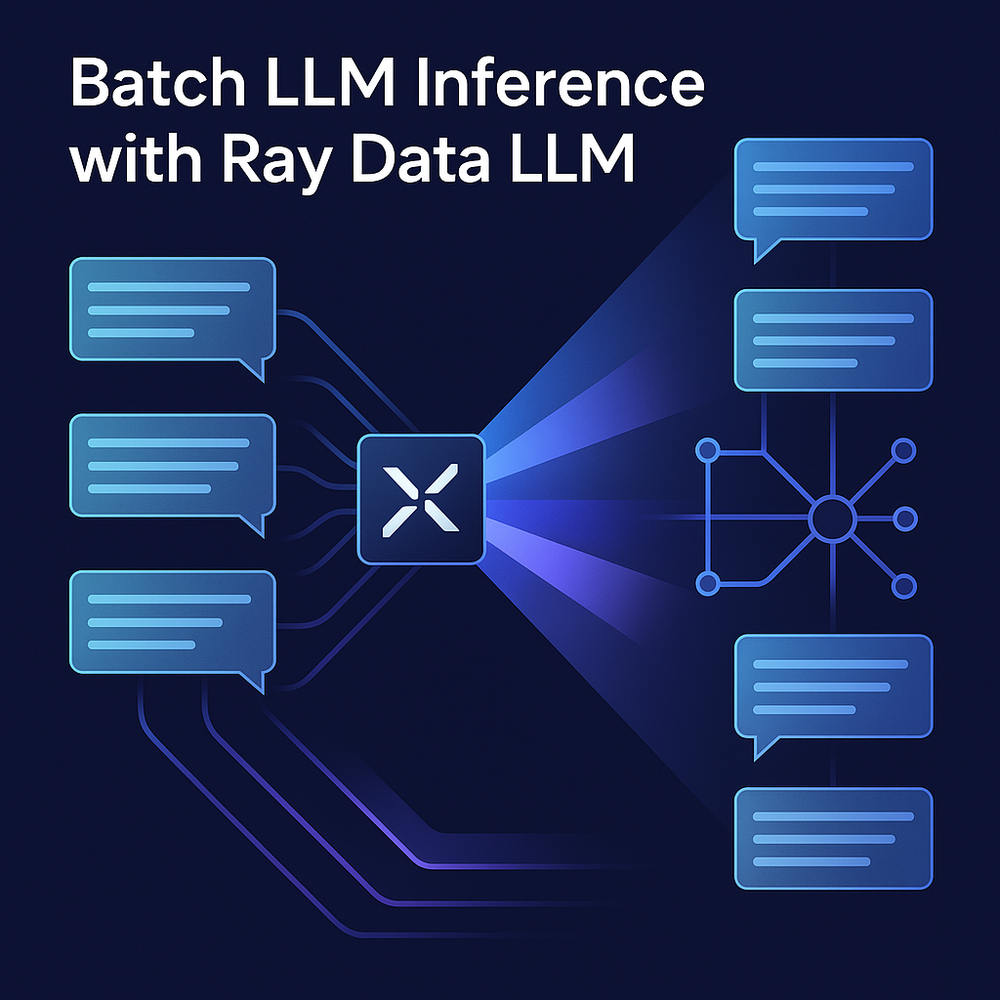

<div align="center">
    
</div>

# Production Deployment for Ray Data LLM

## Table of Contents

<details>
  <summary><a href="#1-about-this-section"><i><b>1. About this Section</b></i></a></summary>
  <div>
              <a href="#11-who-is-this-section-for">1.1. Who Is This Section For?</a><br>
              <a href="#12-what-will-you-learn">1.2. What Will You Learn?</a><br>
              <a href="#13-prerequisites">1.3. Prerequisites</a><br>
              <a href="#14-directory-structure">1.4. Directory Structure</a><br>
  </div>
</details>

## 1. About this Section

This section provides comprehensive guidance for deploying Ray Data LLM in production environments. It transforms the educational concepts from the main repository into a production-ready system with enterprise-grade reliability, scalability, and security.

### 1.1. Who Is This Section For?

This production deployment guide is designed for:

- **DevOps Engineers** responsible for setting up and maintaining LLM inference infrastructure
- **MLOps Specialists** implementing CI/CD pipelines for machine learning models
- **Site Reliability Engineers (SREs)** ensuring the availability and performance of LLM services
- **Data Engineers** building scalable data processing pipelines with Ray
- **Platform Engineers** designing cloud-native architectures for AI/ML workloads

### 1.2. What Will You Learn?

By the end of this section, you will be able to:

- Deploy and scale Ray clusters on Kubernetes using best practices
- Set up infrastructure as code with Terraform for reproducible deployments
- Implement comprehensive monitoring and observability for LLM workloads
- Configure auto-scaling for cost-efficient resource utilization
- Secure your LLM services with proper authentication and authorization
- Implement CI/CD pipelines for continuous deployment of models
- Design high-availability architectures for production LLM services
- Optimize performance for batch and real-time inference workloads

### 1.3. Prerequisites

Before proceeding with production deployment, ensure you have:

- **Kubernetes Fundamentals**: Basic understanding of Kubernetes concepts and operations
- **Cloud Platform Access**: Account with administrative access to a cloud provider (AWS, GCP, or Azure)
- **CLI Tools**:
  - `kubectl` for Kubernetes cluster management
  - `terraform` for infrastructure provisioning
  - `helm` for Kubernetes package management
  - Cloud provider CLI (`aws`, `gcloud`, or `az`)
- **Model Access**: Access to Hugging Face or other model repositories
- **Docker**: Familiarity with container concepts

### 1.4. Directory Structure

```
production/
├── terraform/                      <-- Infrastructure as Code templates
│   ├── main.tf                     <-- Main Terraform configuration 
│   └── variables.tf                <-- Terraform variables definition
│
├── kubernetes/                     <-- Kubernetes manifests
│   ├── ray-cluster.yaml           <-- Ray cluster definition
│   └── ray-serve-llm.yaml         <-- Ray Serve LLM deployment
│
├── monitoring/                     <-- Monitoring configurations
│   └── prometheus-config.yaml     <-- Prometheus and alerting rules
│
├── scripts/                        <-- Utility scripts
│   └── deploy.sh                   <-- Deployment automation script
│
├── config/                         <-- Configuration files
│   └── prod-config.yaml           <-- Production environment config
│
└── README.md                       <-- This documentation
```

## 2. Infrastructure as Code with Terraform

Terraform is used to provision and manage the cloud infrastructure required for running Ray Data LLM in production. The configurations in this directory create a complete production environment with proper networking, security, and scalability.

### 2.1. Terraform Overview

[Terraform](https://www.terraform.io/) is an open-source infrastructure as code (IaC) tool that enables you to safely and predictably create, change, and improve infrastructure. Our Terraform configurations:

- Define cloud resources in a declarative format
- Create reproducible and version-controlled infrastructure
- Support multiple cloud providers with the same workflow
- Manage dependencies between resources automatically

### 2.2. Available Configurations

The Terraform configurations in this directory focus on AWS but follow patterns that can be adapted to other cloud providers:

- **VPC Setup**: Creates a virtual private cloud with proper networking
- **EKS Cluster**: Provisions a Kubernetes cluster optimized for Ray workloads
- **Node Groups**: Configures separate node groups for CPU and GPU workloads
- **IAM Roles**: Sets up appropriate permissions for Ray to access cloud resources
- **Storage**: Creates S3 buckets for model weights and datasets

### 2.3. Customization Options

The `variables.tf` file contains customizable parameters for the infrastructure:

| Variable | Description | Default Value |
|----------|-------------|---------------|
| `aws_region` | AWS region to deploy resources | us-west-2 |
| `environment` | Environment name (dev, staging, prod) | prod |
| `cluster_name` | Name of the EKS cluster | ray-llm-cluster |
| `gpu_node_instance_type` | Instance type for GPU nodes | g4dn.xlarge |
| `gpu_node_min_size` | Minimum number of GPU nodes | 1 |
| `gpu_node_max_size` | Maximum number of GPU nodes | 10 |
| `gpu_node_desired_size` | Desired number of GPU nodes | 2 |
| `cpu_node_instance_type` | Instance type for CPU nodes | m5.2xlarge |
| `cpu_node_min_size` | Minimum number of CPU nodes | 2 |
| `cpu_node_max_size` | Maximum number of CPU nodes | 5 |
| `cpu_node_desired_size` | Desired number of CPU nodes | 2 |

You can override these defaults when applying the Terraform configuration:

```bash
terraform apply -var="gpu_node_instance_type=g4dn.2xlarge" -var="gpu_node_min_size=2"
```

### 2.4. Applying Terraform Configurations

To apply the Terraform configurations:

1. **Initialize Terraform**:
   ```bash
   cd production/terraform
   terraform init
   ```

2. **Create a Workspace** (optional, for multiple environments):
   ```bash
   terraform workspace new prod
   # Or select existing: terraform workspace select prod
   ```

3. **Plan the Changes**:
   ```bash
   terraform plan -var="environment=prod" -var="aws_region=us-west-2"
   ```

4. **Apply the Configuration**:
   ```bash
   terraform apply -var="environment=prod" -var="aws_region=us-west-2"
   ```

5. **Access the Cluster**:
   ```bash
   aws eks update-kubeconfig --name ray-llm-cluster-prod --region us-west-2
   kubectl get nodes
   ```

When finished, you can destroy the infrastructure to avoid ongoing charges:

```bash
terraform destroy -var="environment=prod" -var="aws_region=us-west-2"
```

## 3. Kubernetes Deployment

Kubernetes provides the orchestration layer for deploying and managing Ray clusters. The manifests in this directory define the Ray head and worker nodes, as well as the Ray Serve deployment for LLM serving.

### 3.1. Ray on Kubernetes

Ray runs efficiently on Kubernetes, allowing you to:

- Leverage Kubernetes' built-in orchestration capabilities
- Scale Ray clusters up and down based on demand
- Integrate with existing Kubernetes deployments
- Use cloud provider's managed Kubernetes services (EKS, GKE, AKS)

Ray on Kubernetes involves two main components:

1. **Ray Cluster**: A set of Ray head and worker nodes
2. **Ray Serve**: A deployment for serving LLM models with HTTP endpoints

### 3.2. Ray Operator Overview

The [KubeRay Operator](https://github.com/ray-project/kuberay) simplifies deploying and managing Ray clusters on Kubernetes. It provides custom resources:

- **RayCluster**: Defines a Ray cluster with head and worker nodes
- **RayService**: Combines a Ray cluster with a Ray Serve deployment
- **RayJob**: Executes a Ray job on a cluster

Before deploying, ensure the KubeRay Operator is installed:

```bash
helm repo add kuberay https://ray-project.github.io/kuberay-helm/
helm repo update
helm install kuberay-operator kuberay/kuberay-operator --version 0.6.0
```

### 3.3. Ray Cluster Configuration

The `ray-cluster.yaml` file defines a Ray cluster with CPU and GPU worker groups:

```yaml
apiVersion: ray.io/v1
kind: RayCluster
metadata:
  name: ray-llm-cluster
spec:
  # Head node specification
  headGroupSpec:
    # ...head node config...
  
  # Worker groups
  workerGroupSpecs:
  - name: cpu-worker-group
    # ...CPU worker config...
  - name: gpu-worker-group
    # ...GPU worker config...
```

Key configuration areas:

- **Resource Requests/Limits**: CPU, memory, and GPU allocations
- **Scaling**: Min/max/desired replicas for each worker group
- **Storage**: Volume mounts for logs and model cache
- **Environment Variables**: Configuration for Ray processes

### 3.4. Ray Serve LLM Deployment

The `ray-serve-llm.yaml` file defines a Ray service that deploys multiple LLM models:

```yaml
apiVersion: ray.io/v1
kind: RayService
metadata:
  name: ray-serve-llm
spec:
  # Serve configuration
  serveConfigV2: |
    applications:
      - name: llm-app
        # ...application config...
        deployments:
          - name: llm-router
            # ...router config...
          - name: llama-3-8b
            # ...model config...
          - name: qwen-0.5b
            # ...model config...
  
  # Ray cluster configuration
  rayClusterConfig:
    # ...cluster config...
```

Key configuration areas:

- **Models**: Configuration for each LLM model to deploy
- **Routing**: Load balancing between models
- **Resources**: CPU, memory, and GPU allocations for each model
- **Scaling**: Number of replicas for each model

To deploy these configurations:

```bash
kubectl apply -f production/kubernetes/ray-cluster.yaml
kubectl apply -f production/kubernetes/ray-serve-llm.yaml
```

Access the Ray dashboard and LLM API using port forwarding:

```bash
# Ray Dashboard
kubectl port-forward svc/ray-llm-cluster-head-svc 8265:8265

# Ray Serve LLM API 
kubectl port-forward svc/ray-serve-llm-prod-llm-app-svc 8000:8000
```

The LLM API is compatible with the OpenAI API and can be accessed at `http://localhost:8000/v1`.

## 4. Monitoring and Observability

Monitoring is critical for production LLM deployments to ensure performance, reliability, and cost-efficiency. The configurations in this directory set up comprehensive monitoring and observability for Ray clusters and LLM workloads.

### 4.1. Prometheus Configuration

[Prometheus](https://prometheus.io/) is used for metrics collection and alerting. The `prometheus-config.yaml` file configures:

- **Scrape Configurations**: Define how to collect metrics from Ray
- **Alert Rules**: Define conditions that trigger alerts
- **Job Definitions**: Specify monitoring targets (Ray head, workers, Serve)

Key metrics collected include:

- **Ray Cluster Metrics**: Node counts, task throughput, memory usage
- **LLM Processing Metrics**: Inference latency, throughput, token counts
- **GPU Metrics**: GPU utilization, memory usage, temperature
- **System Metrics**: CPU, memory, disk, network usage

The configuration has job definitions for different components:

```yaml
scrape_configs:
  - job_name: 'ray'
    # ... Ray cluster metrics configuration ...
  
  - job_name: 'ray-serve'
    # ... Ray Serve metrics configuration ...
  
  - job_name: 'node-exporter'
    # ... System metrics configuration ...
```

### 4.2. Grafana Dashboards

[Grafana](https://grafana.com/) provides visualization for the metrics collected by Prometheus. While not included in the configuration files, the deployment script installs Grafana and configures it to connect to Prometheus.

Recommended dashboards for Ray and LLM monitoring:

1. **Ray Cluster Overview**:
   - Node health and count
   - Task throughput and scheduling metrics
   - Memory and resource utilization

2. **LLM Performance Dashboard**:
   - Inference latency (p50, p95, p99)
   - Requests per second
   - Token throughput
   - Error rates

3. **GPU Utilization Dashboard**:
   - GPU memory usage
   - GPU utilization percentages
   - Temperature and power consumption
   - Multi-GPU correlation

To import dashboards into Grafana:

1. Access Grafana UI (e.g., `http://localhost:3000` after port forwarding)
2. Navigate to Dashboards > Import
3. Import dashboard from grafana.com or upload JSON file

### 4.3. Alerting Rules

The `prometheus-config.yaml` includes alerting rules for common failure conditions and performance issues:

```yaml
groups:
- name: ray
  rules:
  - alert: RayNodeDown
    expr: up{job="ray"} == 0
    for: 5m
    # ... alert configuration ...
  
  - alert: HighGPUUsage
    expr: gpu_memory_used / gpu_memory_total > 0.95
    for: 10m
    # ... alert configuration ...
  
  - alert: LLMHighLatency
    expr: llm_request_duration_seconds{quantile="0.95"} > 2
    for: 5m
    # ... alert configuration ...
```

Key alerts include:

- **Node Health**: Alerts when Ray nodes go down
- **Resource Utilization**: Alerts on high GPU/CPU usage
- **Performance**: Alerts on high latency or low throughput
- **Error Rates**: Alerts when error rates exceed thresholds

These alerts can be routed to different notification channels (email, Slack, PagerDuty) using Alertmanager, which is installed as part of the Prometheus deployment.

### 4.4. Logging Strategy

While not explicitly configured in the files, a comprehensive logging strategy for Ray LLM deployments should:

1. **Use Structured Logging**: JSON format for machine parseability
2. **Collect Logs Centrally**: Using tools like Fluentd or Loki
3. **Include Contextual Information**: Request IDs, model names, etc.
4. **Separate Log Levels**: Error, warning, info, debug
5. **Implement Log Retention Policies**: Based on compliance requirements

Example structured log entry for an LLM inference:

```json
{
  "timestamp": "2023-04-10T12:34:56Z",
  "level": "info",
  "message": "LLM inference completed",
  "request_id": "abc-123-xyz",
  "model": "llama-3-8b",
  "input_tokens": 24,
  "output_tokens": 128,
  "latency_ms": 267,
  "success": true
}
```

Implement this logging strategy in your Ray Serve deployments to complement the metrics and alerts.

## 5. Deployment Scripts

Automated deployment scripts ensure consistent, repeatable deployments across environments. The `deploy.sh` script in this directory orchestrates the entire deployment process.

### 5.1. Deploy Script

The `deploy.sh` script automates the deployment process, taking care of:

1. **Infrastructure Provisioning**: Using Terraform
2. **Kubernetes Configuration**: Setting up namespaces and resources
3. **Secret Management**: Creating secrets for model access
4. **Ray Deployment**: Deploying Ray clusters and applications
5. **Monitoring Setup**: Installing Prometheus and Grafana

Basic usage:

```bash
cd production/scripts
./deploy.sh [environment] [region]
```

Where:
- `environment` defaults to `prod` if not specified
- `region` defaults to `us-west-2` if not specified

Example for deploying to staging in eu-west-1:

```bash
./deploy.sh staging eu-west-1
```

### 5.2. Environment Configuration

The deployment script uses environment-specific configurations from the `config/` directory. This allows for different resource allocations, scaling settings, and security configurations across environments.

The script looks for environment variables:

- `HUGGING_FACE_HUB_TOKEN`: Required for accessing Hugging Face models
- `AWS_PROFILE`: Optional, to specify AWS credentials profile
- `KUBECONFIG`: Optional, to specify a custom Kubernetes config file

If `HUGGING_FACE_HUB_TOKEN` is not set, the script will warn but continue with a placeholder value (not recommended for production).

### 5.3. Deployment Workflow

The deployment workflow consists of these main steps:

1. **Verify Prerequisites**:
   - Check for required CLI tools (kubectl, terraform, aws)
   - Verify environment variables

2. **Provision Infrastructure**:
   - Initialize Terraform
   - Apply Terraform configuration
   - Configure kubectl to access the cluster

3. **Prepare Kubernetes Environment**:
   - Create namespaces
   - Create secrets
   - Create persistent volumes

4. **Deploy Ray Components**:
   - Deploy Ray cluster
   - Deploy Ray Serve LLM

5. **Set Up Monitoring**:
   - Deploy Prometheus
   - Deploy Grafana
   - Apply monitoring configurations

6. **Verify Deployment**:
   - Wait for resources to be ready
   - Display access information

### 5.4. Troubleshooting

Common deployment issues and their solutions:

| Issue | Cause | Solution |
|-------|-------|----------|
| Terraform fails with permissions error | Insufficient AWS IAM permissions | Ensure your AWS user/role has required permissions |
| Kubernetes resources not creating | KubeRay Operator not installed | Install the operator with `helm install kuberay-operator` |
| GPU nodes not showing GPU resources | NVIDIA device plugin missing | Install device plugin with `kubectl apply -f https://raw.githubusercontent.com/NVIDIA/k8s-device-plugin/master/nvidia-device-plugin.yml` |
| Models failing to download | Missing or invalid HF token | Set `HUGGING_FACE_HUB_TOKEN` with a valid token |
| Ray workers not joining head | Networking issues | Check security groups and network policies |

To debug deployment issues:

1. Check logs from the deploy script
2. Examine Kubernetes events: `kubectl get events -n <namespace>`
3. Look at pod logs: `kubectl logs <pod-name> -n <namespace>`
4. Verify resource availability: `kubectl describe nodes`

For persistent issues, you can:

1. Run the script with bash debugging: `bash -x deploy.sh`
2. Manually execute each section of the script 
3. Check the cloud provider's management console for issues

## 6. Configuration Files

Configuration files in the `config/` directory provide environment-specific settings for Ray Data LLM deployments. These YAML files centralize configuration parameters, making it easy to maintain different environments (development, staging, production) with appropriate resource allocations and security settings.

### 6.1. Environment-Specific Configs

The `prod-config.yaml` file provides a template for production deployments. You can create similar files for other environments:

- `dev-config.yaml`: For development environments with minimal resources
- `staging-config.yaml`: For pre-production testing with moderate resources
- `prod-config.yaml`: For production with full resource allocation and security

The deployment script automatically loads the appropriate configuration based on the environment parameter.

### 6.2. Configuration Structure

The configuration file is structured into logical sections:

```yaml
# Infrastructure Settings
infrastructure:
  provider: aws
  region: us-west-2
  # ... other infrastructure settings ...

# Ray Cluster Settings
ray:
  head:
    cpu: 4
    memory: 16Gi
  workers:
    # ... worker configurations ...

# LLM Models Configuration
models:
  - name: llama-3-8b
    # ... model configurations ...
  - name: qwen-0.5b
    # ... model configurations ...

# Storage, Monitoring, Logging, Security sections
# ... additional configurations ...
```

This structured approach makes it easy to adjust specific aspects of the deployment without modifying the underlying deployment code.

### 6.3. Security Configuration

The security section of the configuration file controls authentication, authorization, and data protection:

```yaml
# Security
security:
  authentication: true
  authorization: rbac
  data_encryption: true
  network_policy: strict
```

These settings enable:

- **Authentication**: Requires API clients to authenticate with valid credentials
- **Authorization**: Uses role-based access control to limit model access
- **Data Encryption**: Encrypts data at rest and in transit
- **Network Policy**: Restricts network traffic between pods

Implementing these security controls is essential for production deployments handling sensitive data or proprietary models.

### 6.4. Resource Allocation

The configuration file specifies resource allocations for different components:

```yaml
# LLM Models Configuration
models:
  - name: llama-3-8b
    id: meta-llama/Llama-3.1-8B-Instruct
    replicas: 1
    tensor_parallel_size: 1
    max_batch_tokens: 4096
    model_len: 16384
    resources:
      cpu: 4
      memory: 16Gi
      gpu: 1
```

Key resource allocation parameters:

- **CPU/Memory/GPU**: Hardware resources allocated to each component
- **Replicas**: Number of instances for each model
- **Tensor Parallel Size**: Number of GPUs used for model parallelism
- **Batch Size Parameters**: Controls token processing throughput

Properly tuning these parameters is essential for optimizing performance and cost in production deployments.

## 7. Scaling Strategies

Effective scaling is crucial for production LLM deployments to handle varying loads efficiently while minimizing costs. This section covers strategies for scaling Ray clusters and LLM inference workloads.

### 7.1. Horizontal vs. Vertical Scaling

Ray Data LLM supports both horizontal and vertical scaling approaches:

**Horizontal Scaling** (increasing number of nodes):
- Add more worker nodes to process additional requests
- Configured via `replicas`, `min_replicas`, and `max_replicas` in Kubernetes manifests
- Best for handling increased request volume
- Easier to scale automatically based on load
- Example in `ray-cluster.yaml`:
  ```yaml
  workerGroupSpecs:
  - name: gpu-worker-group
    replicas: 2
    minReplicas: 1
    maxReplicas: 10
  ```

**Vertical Scaling** (increasing node resources):
- Use larger/more powerful instances for workers
- Configured via resource requests/limits and instance types
- Best for handling larger models or increasing throughput per node
- Requires careful selection of appropriate hardware
- Example in Terraform variables:
  ```terraform
  variable "gpu_node_instance_type" {
    default = "g4dn.xlarge"  # Can upgrade to g4dn.2xlarge for vertical scaling
  }
  ```

Most production deployments benefit from a combination of both approaches.

### 7.2. Autoscaling Configuration

Ray with Kubernetes supports autoscaling to dynamically adjust resources based on load:

**Kubernetes Cluster Autoscaler**:
- Automatically adjusts the number of nodes in your cluster
- Works with cloud provider node groups/instance groups
- Configure min/max nodes in Terraform:
  ```terraform
  variable "gpu_node_min_size" {
    default = 1
  }
  variable "gpu_node_max_size" {
    default = 10
  }
  ```

**Ray Worker Autoscaling**:
- Controls the number of Ray workers within existing nodes
- Configure in Ray Cluster specification:
  ```yaml
  workerGroupSpecs:
  - name: gpu-worker-group
    minReplicas: 1
    maxReplicas: 10
  ```

**Ray Serve Deployment Autoscaling**:
- Adjusts the number of replicas for specific model deployments
- Configure in Ray Serve LLM deployment:
  ```yaml
  deployments:
    - name: llama-3-8b
      autoscaling_config:
        min_replicas: 1
        max_replicas: 5
        target_num_ongoing_requests_per_replica: 10
  ```

### 7.3. Performance Optimization

To optimize performance for LLM inference workloads:

**Batch Processing Optimization**:
- Tune `batch_size` and `max_num_batched_tokens` for your workload
- Larger batch sizes generally increase throughput at the cost of latency
- Example configuration:
  ```python
  config = vLLMEngineProcessorConfig(
      model="meta-llama/Llama-3.1-8B-Instruct",
      batch_size=64,
      engine_kwargs={
          "max_num_batched_tokens": 4096,
      }
  )
  ```

**Model Parallelism**:
- Distribute large models across multiple GPUs using `tensor_parallel_size`
- Essential for models larger than a single GPU's memory
- Example configuration:
  ```yaml
  models:
    - name: llama-3-8b
      tensor_parallel_size: 2  # Split model across 2 GPUs
  ```

**GPU Memory Optimization**:
- Enable chunked prefill to reduce memory usage: `enable_chunked_prefill: true`
- Control GPU memory utilization: `gpu_memory_utilization: 0.85`
- Balance between model size and performance requirements

### 7.4. Cost Management

Strategies to optimize costs for production LLM deployments:

**Right-sizing Resources**:
- Match resource allocations to actual workload requirements
- Monitor utilization and adjust as needed
- Use the smallest instance types that meet performance requirements

**Spot Instances**:
- Use spot/preemptible instances for non-critical workloads
- Configure in Terraform for significant cost savings
- Ensure proper handling of instance termination

**Scheduled Scaling**:
- Reduce capacity during low-usage periods (nights, weekends)
- Implement using Kubernetes CronJobs to modify deployments
- Example schedule to scale down at night:
  ```yaml
  apiVersion: batch/v1
  kind: CronJob
  metadata:
    name: scale-down-night
  spec:
    schedule: "0 0 * * *"  # Midnight UTC
    jobTemplate:
      spec:
        template:
          spec:
            containers:
            - name: kubectl
              image: bitnami/kubectl
              command: ["kubectl", "scale", "raycluster/ray-llm-cluster", "--replicas=1"]
  ```

**Caching Strategies**:
- Implement response caching for common queries
- Use distributed cache like Redis for sharing across nodes
- Configure time-to-live (TTL) based on your use case

## 8. Security Best Practices

Security is a critical aspect of production LLM deployments, especially when handling sensitive data or deploying proprietary models. This section covers comprehensive security practices for Ray Data LLM deployments.

### 8.1. Authentication and Authorization

Implement proper authentication and authorization to secure your LLM API endpoints:

**API Authentication**:
- Use API keys or JWT tokens to authenticate clients
- Store credentials securely in Kubernetes secrets
- Implement token validation middleware:
  ```python
  @serve.deployment
  class AuthMiddleware:
      def __init__(self, app):
          self.app = app
          self.valid_keys = load_api_keys_from_secure_storage()
          
      async def __call__(self, request):
          auth_header = request.headers.get("Authorization")
          if not auth_header or not self._validate_token(auth_header):
              return {"error": "Unauthorized"}, 401
          return await self.app.handle_request(request)
  ```

**Role-Based Access Control (RBAC)**:
- Define different access levels for models and operations
- Implement model access restrictions based on user/client roles
- Use Kubernetes RBAC for cluster-level access control
- Example role permission mapping:
  ```python
  role_permissions = {
      "basic": ["qwen-0.5b"],
      "premium": ["qwen-0.5b", "llama-3-8b"],
      "admin": ["qwen-0.5b", "llama-3-8b", "admin-operations"]
  }
  ```

**Rate Limiting**:
- Implement per-client rate limits to prevent abuse
- Use token bucket algorithms for flexible rate limiting
- Configure different limits for different client tiers

### 8.2. Network Security

Secure network communication within and to your Ray cluster:

**TLS/SSL Encryption**:
- Enable HTTPS for all external API endpoints
- Use cert-manager in Kubernetes to manage certificates
- Example TLS configuration in Kubernetes Ingress:
  ```yaml
  apiVersion: networking.k8s.io/v1
  kind: Ingress
  metadata:
    name: llm-api-ingress
    annotations:
      cert-manager.io/cluster-issuer: "letsencrypt-prod"
  spec:
    tls:
    - hosts:
      - llm-api.example.com
      secretName: llm-api-tls
    rules:
    - host: llm-api.example.com
      http:
        paths:
        - path: /
          pathType: Prefix
          backend:
            service:
              name: ray-serve-llm-prod-llm-app-svc
              port:
                number: 8000
  ```

**Network Policies**:
- Restrict pod-to-pod communication using Kubernetes Network Policies
- Allow only necessary communication paths
- Example policy restricting database access:
  ```yaml
  apiVersion: networking.k8s.io/v1
  kind: NetworkPolicy
  metadata:
    name: db-access-policy
  spec:
    podSelector:
      matchLabels:
        role: database
    ingress:
    - from:
      - podSelector:
          matchLabels:
            app: ray-head
    ```

**Private Networking**:
- Deploy Ray clusters in private subnets
- Use VPC/VNet peering for secure cross-network access
- Configure bastion hosts for administrative access

### 8.3. Secrets Management

Securely manage sensitive information needed by your deployment:

**Kubernetes Secrets**:
- Store API tokens, credentials, and other secrets
- Never hardcode sensitive data in configuration files or images
- Example creating a secret for Hugging Face token:
  ```bash
  kubectl create secret generic hf-token \
    --from-literal=token=YOUR_TOKEN_HERE
  ```

**External Secrets Management**:
- For production, use cloud provider secrets services:
  - AWS Secrets Manager
  - Azure Key Vault
  - Google Secret Manager
- Use solutions like external-secrets operator to integrate
- Example external secrets configuration:
  ```yaml
  apiVersion: external-secrets.io/v1beta1
  kind: ExternalSecret
  metadata:
    name: hf-token
  spec:
    refreshInterval: 1h
    secretStoreRef:
      name: aws-secretsmanager
      kind: ClusterSecretStore
    target:
      name: hf-token
    data:
    - secretKey: token
      remoteRef:
        key: llm/huggingface-token
  ```

**Runtime Access to Secrets**:
- Mount secrets as environment variables or files
- Limit access to pods that need the information
- Example in Ray cluster configuration:
  ```yaml
  env:
  - name: HUGGING_FACE_HUB_TOKEN
    valueFrom:
      secretKeyRef:
        name: hf-token
        key: token
  ```

### 8.4. Data Protection

Protect data processed by your LLM services:

**Data Encryption**:
- Enable encryption at rest for all storage (EBS volumes, S3 buckets)
- Use TLS for all data in transit
- Consider field-level encryption for sensitive data

**Input/Output Filtering**:
- Implement content filtering for both inputs and outputs
- Prevent prompt injection attacks
- Screen outputs for sensitive information
- Example input filtering:
  ```python
  def filter_input(prompt):
      # Check for potential injection patterns
      if contains_injection_patterns(prompt):
          return sanitize_prompt(prompt)
      return prompt
  ```

**Data Retention Policies**:
- Define and implement data retention periods
- Automatically purge data older than retention period
- Consider regulatory requirements (GDPR, CCPA, etc.)

**Privacy Controls**:
- Implement user data access controls
- Provide opt-out mechanisms where appropriate
- Maintain audit logs of data access

## 9. Cloud Provider Specific Guides

This section provides specific guidance for deploying Ray Data LLM on different cloud providers, highlighting the differences in configuration and best practices.

### 9.1. AWS Deployment

AWS is the primary cloud provider used in our Terraform configurations. Key AWS components for Ray Data LLM:

**EKS (Elastic Kubernetes Service)**:
- Managed Kubernetes control plane
- Integrates with AWS IAM for authentication
- Supports autoscaling through Cluster Autoscaler

**EC2 Instances for Worker Nodes**:
- g4dn.xlarge or larger for GPU workloads
- m5.2xlarge or similar for CPU workloads
- Consider Graviton instances for cost savings on CPU workloads

**S3 for Storage**:
- Store model weights and datasets
- Configure lifecycle policies for cost management
- Enable versioning for model weights

**IAM for Access Control**:
- Create dedicated IAM roles for Ray clusters
- Use IRSA (IAM Roles for Service Accounts) with EKS
- Follow principle of least privilege

AWS-specific deployment tips:

1. Enable EBS CSI driver for persistent storage:
   ```bash
   eksctl create iamserviceaccount \
     --name ebs-csi-controller-sa \
     --namespace kube-system \
     --cluster ray-llm-cluster \
     --role-name AmazonEKS_EBS_CSI_DriverRole \
     --role-only \
     --attach-policy-arn arn:aws:iam::aws:policy/service-role/AmazonEBSCSIDriverPolicy
   ```

2. Use placement groups for lower latency between nodes:
   ```terraform
   resource "aws_placement_group" "ray_cluster" {
     name     = "ray-cluster-placement-group"
     strategy = "cluster"
   }
   ```

3. Consider AWS Inferentia or AWS Trainium for cost-effective inference

### 9.2. GCP Deployment

For Google Cloud Platform deployments, make these adjustments:

**GKE (Google Kubernetes Engine)**:
- Replace EKS with GKE in Terraform configurations
- Use Workload Identity for authentication
- Enable GKE Autopilot for simplified management

**GCP Instance Types**:
- Use A2 or T4 instances for GPU workloads
- Use N2 or C2 instances for CPU workloads
- Consider spot instances for non-critical workloads

**GCS for Storage**:
- Replace S3 with Google Cloud Storage
- Configure appropriate IAM permissions

GCP-specific Terraform configuration:

```terraform
provider "google" {
  project = var.gcp_project
  region  = var.gcp_region
}

resource "google_container_cluster" "ray_cluster" {
  name     = "ray-llm-cluster"
  location = var.gcp_region
  
  # Remove default node pool
  remove_default_node_pool = true
  initial_node_count       = 1
}

resource "google_container_node_pool" "gpu_nodes" {
  name       = "gpu-node-pool"
  cluster    = google_container_cluster.ray_cluster.id
  node_count = var.gpu_node_desired_size

  autoscaling {
    min_node_count = var.gpu_node_min_size
    max_node_count = var.gpu_node_max_size
  }

  node_config {
    machine_type = "n1-standard-8"
    
    guest_accelerator {
      type  = "nvidia-tesla-t4"
      count = 1
    }
  }
}
```

### 9.3. Azure Deployment

For Microsoft Azure deployments:

**AKS (Azure Kubernetes Service)**:
- Replace EKS with AKS in Terraform configurations
- Use Azure AD for authentication
- Consider Virtual Node for rapid scaling

**Azure VM Types**:
- Use NC or ND series for GPU workloads
- Use D or F series for CPU workloads
- Consider Azure Spot VMs for cost savings

**Azure Storage**:
- Use Azure Blob Storage for model weights
- Consider Azure NetApp Files for shared file systems

Azure-specific Terraform configuration:

```terraform
provider "azurerm" {
  features {}
}

resource "azurerm_resource_group" "ray_rg" {
  name     = "ray-llm-resources"
  location = var.azure_region
}

resource "azurerm_kubernetes_cluster" "ray_cluster" {
  name                = "ray-llm-cluster"
  location            = azurerm_resource_group.ray_rg.location
  resource_group_name = azurerm_resource_group.ray_rg.name
  dns_prefix          = "rayllm"

  default_node_pool {
    name       = "default"
    node_count = 1
    vm_size    = "Standard_D2_v2"
  }

  identity {
    type = "SystemAssigned"
  }
}

resource "azurerm_kubernetes_cluster_node_pool" "gpu_pool" {
  name                  = "gpunodepool"
  kubernetes_cluster_id = azurerm_kubernetes_cluster.ray_cluster.id
  vm_size               = "Standard_NC6s_v3"
  node_count            = var.gpu_node_desired_size
  
  enable_auto_scaling   = true
  min_count             = var.gpu_node_min_size
  max_count             = var.gpu_node_max_size
}
```

### 9.4. Multi-Cloud Considerations

For organizations considering multi-cloud deployments:

**Cross-Cloud Coordination**:
- Use tools like Anthos or Rancher for multi-cloud Kubernetes
- Implement consistent monitoring across clouds
- Standardize on container images and configurations

**Data Synchronization**:
- Set up cross-cloud data replication for model weights
- Consider solutions like Rclone or cloud-specific replication services
- Ensure consistent versioning across clouds

**Traffic Management**:
- Implement global load balancing with solutions like CloudFlare
- Configure failover between cloud providers
- Use consistent DNS naming across deployments

**Challenges and Considerations**:
- Increased operational complexity
- Potential for inconsistent behavior
- Higher networking costs for cross-cloud traffic
- More complex security architecture

## 10. Continuous Integration and Deployment

Implementing CI/CD pipelines ensures consistent, reliable deployments of your Ray Data LLM applications.

### 10.1. CI/CD Pipeline Overview

A comprehensive CI/CD pipeline for Ray Data LLM should include:

1. **Code Validation**:
   - Linting and static analysis
   - Unit and integration testing
   - Security scanning

2. **Docker Image Building**:
   - Build container images for Ray components
   - Version images consistently
   - Scan images for vulnerabilities

3. **Infrastructure Validation**:
   - Terraform plan and validation
   - Kubernetes manifest validation
   - Policy compliance checks

4. **Deployment**:
   - Staged rollout (dev → staging → production)
   - Smoke tests after deployment
   - Automatic rollback on failure

5. **Model Lifecycle Management**:
   - Model versioning and tracking
   - A/B testing of model versions
   - Model performance validation

### 10.2. GitHub Actions Workflow

Example GitHub Actions workflow for CI/CD:

```yaml
name: Ray LLM CI/CD

on:
  push:
    branches: [ main ]
  pull_request:
    branches: [ main ]

jobs:
  test:
    runs-on: ubuntu-latest
    steps:
    - uses: actions/checkout@v3
    - name: Set up Python
      uses: actions/setup-python@v4
      with:
        python-version: '3.10'
    - name: Install dependencies
      run: |
        python -m pip install --upgrade pip
        pip install -r requirements.txt
    - name: Lint code
      run: |
        pip install flake8
        flake8 scripts/
    - name: Run tests
      run: |
        pip install pytest
        pytest tests/

  build:
    needs: test
    runs-on: ubuntu-latest
    steps:
    - uses: actions/checkout@v3
    - name: Set up Docker Buildx
      uses: docker/setup-buildx-action@v2
    - name: Login to DockerHub
      uses: docker/login-action@v2
      with:
        username: ${{ secrets.DOCKERHUB_USERNAME }}
        password: ${{ secrets.DOCKERHUB_TOKEN }}
    - name: Build and push Docker image
      uses: docker/build-push-action@v4
      with:
        context: .
        push: true
        tags: yourorg/ray-llm:${{ github.sha }}

  deploy-dev:
    needs: build
    runs-on: ubuntu-latest
    steps:
    - uses: actions/checkout@v3
    - name: Set up Terraform
      uses: hashicorp/setup-terraform@v2
    - name: Configure AWS credentials
      uses: aws-actions/configure-aws-credentials@v1
      with:
        aws-access-key-id: ${{ secrets.AWS_ACCESS_KEY_ID }}
        aws-secret-access-key: ${{ secrets.AWS_SECRET_ACCESS_KEY }}
        aws-region: us-west-2
    - name: Deploy to dev environment
      run: |
        cd production/scripts
        ./deploy.sh dev us-west-2
```

### 10.3. Jenkins Pipeline

Example Jenkinsfile for traditional CI/CD environments:

```groovy
pipeline {
    agent any
    
    environment {
        AWS_REGION = 'us-west-2'
        DOCKER_REGISTRY = 'yourcompany.jfrog.io'
    }
    
    stages {
        stage('Checkout') {
            steps {
                checkout scm
            }
        }
        
        stage('Test') {
            steps {
                sh '''
                    python -m pip install --upgrade pip
                    pip install -r requirements.txt
                    pip install flake8 pytest
                    flake8 scripts/
                    pytest tests/
                '''
            }
        }
        
        stage('Build Docker Image') {
            steps {
                sh '''
                    docker build -t ${DOCKER_REGISTRY}/ray-llm:${BUILD_NUMBER} .
                    docker push ${DOCKER_REGISTRY}/ray-llm:${BUILD_NUMBER}
                '''
            }
        }
        
        stage('Terraform Plan') {
            steps {
                sh '''
                    cd production/terraform
                    terraform init
                    terraform plan -var="environment=dev" -var="aws_region=${AWS_REGION}" -out=tfplan
                '''
            }
        }
        
        stage('Deploy to Dev') {
            when {
                branch 'develop'
            }
            steps {
                sh '''
                    cd production/scripts
                    ./deploy.sh dev ${AWS_REGION}
                '''
            }
        }
        
        stage('Deploy to Staging') {
            when {
                branch 'staging'
            }
            steps {
                sh '''
                    cd production/scripts
                    ./deploy.sh staging ${AWS_REGION}
                '''
            }
        }
        
        stage('Deploy to Production') {
            when {
                branch 'main'
            }
            steps {
                input message: 'Deploy to production?'
                sh '''
                    cd production/scripts
                    ./deploy.sh prod ${AWS_REGION}
                '''
            }
        }
    }
}
```

### 10.4. Deployment Strategies

Different strategies for deploying updates to your Ray Data LLM services:

**Blue-Green Deployment**:
- Maintain two identical environments (blue and active green)
- Deploy changes to inactive environment
- Switch traffic when testing confirms success
- Implementation with Kubernetes:
  ```bash
  # Deploy new version as 'blue'
  kubectl apply -f ray-serve-llm-blue.yaml
  
  # Test the blue environment
  # ...testing...
  
  # Switch traffic to blue environment
  kubectl patch service ray-llm-api -p '{"spec":{"selector":{"deployment":"blue"}}}'
  ```

**Canary Deployment**:
- Gradually route traffic to new version
- Monitor for errors or performance issues
- Roll back quickly if problems detected
- Implementation in Ray Serve:
  ```python
  @serve.deployment(name="llm-router", num_replicas=2)
  class ModelRouter:
      def __init__(self, canary_percentage=0):
          self.models = {
              "current": ray.get_actor("llama-3-8b-current"),
              "canary": ray.get_actor("llama-3-8b-canary")
          }
          self.canary_percentage = canary_percentage
          
      async def __call__(self, request):
          # Route percentage of traffic to canary
          if random.random() < (self.canary_percentage / 100):
              return await self.models["canary"].process(request)
          return await self.models["current"].process(request)
  ```

**Rolling Updates**:
- Update instances one by one
- Maintain availability during updates
- Default strategy for Kubernetes deployments
- Implementation in Kubernetes:
  ```yaml
  spec:
    strategy:
      type: RollingUpdate
      rollingUpdate:
        maxUnavailable: 25%
        maxSurge: 25%
  ```

Choose the appropriate strategy based on your application's requirements for availability, risk tolerance, and testing needs.